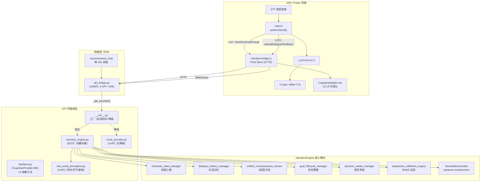
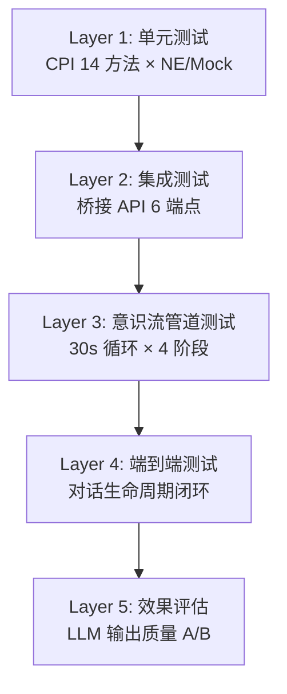

# 意识流全套组件 × AIRI 集成深度评估报告

> **评估日期**: 2026-03-13  
> **评估者**: AI 系统架构评审  
> **评估范围**: 通用感知系统 · 9层因果链意识流 · 记忆系统 · RGES系统 · CPI可插拔架构 · AIRI完整集成链路  
> **代码审计**: 6 个核心文件, 共 ~3,000 行后端 + ~850 行前端

---

## 一、集成拓扑全景



---

## 二、14 个 CPI 能力集成状态审计

| # | CPI 方法 | 覆盖层 | NE 实现 | Mock 实现 | 前端调用链路 | 实际效果 |
|---|---------|--------|---------|-----------|-------------|---------|
| 1 | `get_character_config()` | — | ✅ JSON 读取+缓存 | ✅ JSON 读取 | ✅ 角色配置 CRUD API | 🟢 已验证 |
| 2 | `get_personality()` | L1 | ✅ 配置文件 | ✅ 配置文件 | ✅ 大五人格行为描述 | 🟢 已验证 |
| 3 | `get_psychological_state()` | L2-4 | ✅ CSM singleton + 需求 | ✅ 静态 | ✅ prompt 注入 | 🟡 依赖 CSM 初始化 |
| 4 | `get_perception()` | L0 | ✅ 真实世界管道 | ✅ 系统时间 | ✅ 环境感知+节日 | 🟢 已验证 |
| 5 | `get_consciousness()` | L7 | ⚠️ UCS 每次 `new()` | ✅ 返回 None | ✅ 意识流注入 | 🟡 非 singleton |
| 6 | `get_active_goals()` | L5-6 | ⚠️ GLM 每次 `new()` | ✅ 配置文件 | ✅ 目标层广播 | 🟡 非 singleton |
| 7 | `recall_memories()` | L3 | ✅ 向量+关键词双通道 | ✅ 空列表 | ✅ 语义检索广播 | 🟢 Phase 7 完成 |
| 8 | `store_memory()` | L3 | ✅ DHM + 文件降级 + 向量 | ✅ 跳过 | ✅ 对话反馈 | 🟢 三重保障 |
| 9 | `process_stimulus()` | L0-8 | ⚠️ UCS 每次 `new()` | ✅ 返回 mock | ✅ 4 阶段广播 | 🟡 非 singleton |
| 10 | `submit_experience()` | L9 | ✅ L4存储+L2升级+RGES触发 | ✅ 空操作 | ✅ 对话反馈闭环 | 🟢 已验证 |
| 11 | `get_reflections()` | L9 | ⚠️ ERE 每次 `new()` | ✅ 空列表 | ✅ 反思洞察注入 | 🟡 非 singleton |
| 12 | `build_enriched_prompt()` | All | ✅ 全层聚合 | ✅ 简化版 | ✅ 系统 prompt | 🟢 Phase 5d |
| 13 | `update_character_config()` | — | ✅ 深度合并+持久化 | ✅ 内存合并 | ✅ PUT API | 🟢 Phase 5f |
| 14 | `needs_to_natural_language()` | L4 | ✅ 5 级自然语言 | ✅ "状态正常" | ✅ 身体状态描述 | 🟢 已验证 |

> **通过率**: 14/14 方法已实现 (100%)，其中 10/14 效果良好 (🟢)，4/14 有 singleton 隐患 (🟡)

---

## 三、解耦性评估 (满分 5⭐)

### 3.1 架构层解耦

| 维度 | 评分 | 证据 |
|------|------|------|
| **桥接层 ↔ 核心** | ⭐⭐⭐⭐⭐ | `airi_bridge.py` 仅通过 `_get_provider()` 访问核心，零直接 `import core` |
| **前端 ↔ 后端** | ⭐⭐⭐⭐⭐ | HTTP + WebSocket 通信，TypeScript 类型独立定义 |
| **CPI 接口隔离** | ⭐⭐⭐⭐⭐ | ABC 抽象类 14 方法，NE/Mock 独立实现 |
| **降级容错** | ⭐⭐⭐⭐⭐ | 工厂自动检测 → NE / Mock 切换，单方法 try/except |
| **角色可插拔** | ⭐⭐⭐⭐ | JSON 驱动，支持 CRUD API，但角色 ID 在前端硬编码为 `saihisis` |
| **认知引擎可替换** | ⭐⭐⭐⭐⭐ | 新增 Provider 只需实现 14 方法 + 注册到工厂 |

> **综合解耦评分**: **4.8/5** — 架构设计优秀，CPI 抽象层是核心亮点

### 3.2 插拔能力矩阵

| 场景 | 可行性 | 操作 |
|------|--------|------|
| 替换 NE 核心为新引擎 | ✅ 0 代码改动 | 新建 `xxx_provider.py` 实现 `ICognitiveProvider` |
| 使用 Mock 进行前端开发 | ✅ 自动 | NE 不可用时自动降级 |
| 切换角色 | ✅ API 调用 | 修改前端 `characterId` / 新建角色 JSON |
| 接入新感知源 | ✅ 低侵入 | 修改 `real_world_perception.py` |
| 更换 LLM | ✅ 前端配置 | AIRI 设置面板切换 Provider/Model |
| 禁用意识流自驱 | ✅ API 调用 | `POST /consciousness/stop` |
| Discord Bot 接入 | ⚠️ 需开发 | Bot 需调用 CPI API (当前零集成) |

---

## 四、风险与技术债

### 🔴 高优先级

| 问题 | 位置 | 影响 | 建议 |
|------|------|------|------|
| **UCS/GLM/ERE 非 singleton** | `narrative_engine.py` L448, L435, L700 | 每次调用 `new()`，状态无法累积、内存泄漏 | 迁移到 singleton getter 或在 CPI 内部缓存实例 |
| **意识流自驱未实际端到端验证** | 全链路 | 30s 循环 + 主动对话未经实际测试 | 建立自动化端到端测试 |
| **CPI 无测试覆盖** | `api/cpi/` | 14 个方法零单元测试 | 建立 pytest 测试套件 |

### 🟡 中优先级

| 问题 | 位置 | 影响 | 建议 |
|------|------|------|------|
| 角色 ID 前端硬编码 `saihisis` | `narrative-bridge.ts` L69 | 不支持多角色切换 | 从 airi-card 配置动态读取 |
| `proactive_dialogue` 仅广播 | `chat.ts` L370 | 前端收到事件但未自动触发对话 | 在 `chat.ts` 中监听并自动发送 |
| `reasoning_content` 未在前端传递 | `chat.ts` L371 | `submitDialogueFeedback` 不传 reasoning | 从 `buildingMessage.categorization.reasoning` 提取 |
| 天气/新闻可能被 GFW 阻断 | `real_world_perception.py` | 感知数据不完整 | 增加国内 API 可选源 |

### 🟢 低优先级

| 问题 | 位置 | 影响 |
|------|------|------|
| `build_enriched_prompt()` 在 NE CPI 中实现但桥接层用 `get_enriched_system_prompt()` 自组装 | 两处冗余 | 维护成本 |
| `_estimate_importance()` 使用硬编码关键词 | `airi_bridge.py` L870 | 主动开口决策粗糙 |
| 向量索引使用 pickle 序列化 | `narrative_engine.py` L83 | 安全风险 (反序列化攻击) |

---

## 五、意识流自驱完整链路测试方案

### 5.1 分层测试架构



### 5.2 Layer 1 — CPI 单元测试 (`test_cpi_unit.py`)

```python
# 测试每个 CPI 方法的输入输出契约
class TestNarrativeEngineCPI:
    def test_get_perception_returns_time(self):
        # 验证真实世界感知包含 time_period, date_display
    def test_recall_memories_vector_search(self):
        # 向量检索: 添加 3 条记忆, query 检索, 验证相似度排序
    def test_recall_memories_keyword_fallback(self):
        # 向量不可用时降级到关键词匹配
    def test_store_memory_three_tier(self):
        # DHM → 文件降级 → 向量同步
    def test_process_stimulus_ucs_4_stages(self):
        # 验证 perception/processing/decision/execution 4 阶段
    def test_submit_experience_full_pipeline(self):
        # L4 存储 + L2 关键信息提取 + RGES 触发
    def test_get_reflections_after_experience(self):
        # submit_experience 后能获取到反思洞察
    
class TestMockCPI:
    def test_all_14_methods_return_valid_types(self):
        # Mock 所有方法返回类型正确
    def test_mock_graceful_degradation(self):
        # 所有方法返回合理默认值, 不抛异常
```

**运行**: `pytest tests/test_cpi_unit.py -v`

### 5.3 Layer 2 — 桥接 API 集成测试 (`test_bridge_api.py`)

```python
# 使用 FastAPI TestClient, 配合 MockProvider
class TestBridgeAPI:
    def test_get_character_state(self):
        # GET /api/airi/character-state/saihisis → 验证 JSON schema
    def test_get_enriched_system_prompt(self):
        # GET /system-prompt → 验证 prompt 包含身份/心理/感知/记忆/目标/反思
    def test_dialogue_feedback_pipeline(self):
        # POST /dialogue-feedback → 验证 memory_stored + rges_triggered
    def test_cognitive_log_accumulation(self):
        # 多次调用 API → GET /cognitive-log → 验证事件数量递增
    def test_health_endpoint(self):
        # GET /health → 验证所有状态字段存在
    def test_character_config_crud(self):
        # GET → PUT (部分更新) → GET → 验证深度合并正确
```

**运行**: `pytest tests/test_bridge_api.py -v`

### 5.4 Layer 3 — 意识流管道测试 (`test_consciousness_pipeline.py`)

```python
# 模拟 consciousness_loop 执行 3-5 个周期
class TestConsciousnessPipeline:
    async def test_consciousness_loop_3_cycles(self):
        # 启动循环 (interval=2s) → 等待 3 周期 → 验证:
        # 1. 至少 3 个 L0 感知事件
        # 2. 至少 3 个 L2 心理评估事件
        # 3. 如果 UCS 可用, 验证 4 阶段广播 (L0→L2→L6→L8)
        # 4. 情绪变化追踪 (如果有变化)
        # 5. 需求层 L4 广播
    
    async def test_proactive_dialogue_trigger(self):
        # 注入高重要度刺激 → 验证 proactive_dialogue 事件广播
    
    async def test_consciousness_start_stop(self):
        # POST start → 验证 running → POST stop → 验证 stopped
```

### 5.5 Layer 4 — 端到端对话闭环测试 (`test_e2e_dialogue.py`)

```python
# 模拟完整对话生命周期 (需要后端运行)
class TestE2EDialogue:
    async def test_full_dialogue_lifecycle(self):
        """
        1. GET /system-prompt → 获取增强 prompt
        2. 验证 prompt 包含: 身份/心理/感知/记忆
        3. POST /dialogue-feedback → 提交对话反馈
        4. 验证: memory_stored=True, key_facts_extracted (如果输入含关键信息)
        5. 再次 GET /system-prompt → 验证记忆已更新
        6. GET /cognitive-log → 验证完整事件链: L0→L2→L3→L5→L7→L9→L6
        """
    
    async def test_10_round_conversation(self):
        """10 轮对话后验证:
        - 记忆积累 (至少 10 条)
        - 向量索引增长
        - RGES 反思存在
        - prompt 长度变化
        """
    
    async def test_key_fact_extraction_accuracy(self):
        """输入包含姓名/偏好/事件的对话 → 验证 L2 记忆升级正确"""
```

### 5.6 Layer 5 — 效果评估 (A/B 对比)

| 评估维度 | 方法 | 指标 |
|----------|------|------|
| **人格一致性** | 10 轮对话 × 有/无意识流 | MBTI 行为吻合率 |
| **记忆连贯性** | 第 1 轮提供姓名, 第 5 轮询问回忆 | 正确回忆率 |
| **情绪感知** | 不同时段/天气对话 | 回复是否体现环境感知 |
| **主动性** | 连续 5 分钟无用户输入 | 主动开口次数+质量 |
| **反思深度** | 20 轮对话后读取 RGES 洞察 | 洞察与对话内容相关性 |

### 5.7 持续迭代流程

```
┌─────────────────────────────────────────────┐
│  迭代周期 (每周一次)                          │
│                                              │
│  1. pytest 全套 (L1-L4) → 报告              │
│  2. 启动意识流 → 10 轮对话 → 录屏           │
│  3. 导出 cognitive_log → 分析 9 层覆盖率     │
│  4. A/B 对比: 有/无 CPI → 对话质量评分       │
│  5. 识别弱层 → 针对性优化                     │
│  6. 回归测试 → 提交                           │
└─────────────────────────────────────────────┘
```

---

## 六、综合评分

| 维度 | 评分 | 说明 |
|------|------|------|
| **架构解耦** | 9/10 | CPI ABC + 工厂模式 + 自动降级，教科书级设计 |
| **功能覆盖** | 8/10 | 14/14 方法实现，9 层覆盖，Phase 7 向量检索 |
| **插拔灵活性** | 9/10 | 替换引擎/角色/感知源零改桥接层 |
| **测试就绪度** | 3/10 | 设计良好但零测试覆盖，无自动化验证 |
| **生产就绪度** | 5/10 | singleton 隐患 + 未端到端验证 + proactive 未闭环 |
| **意识流自驱效果** | 6/10 | 管道完整但输出质量未验证 |

> **总分: 40/60 (67%)** — 架构优秀，亟需测试和效果验证

---

## 七、优先行动建议

| 优先级 | 行动 | 预期产出 | 工时 |
|--------|------|----------|------|
| **P0** | 建立 CPI 单元测试 + API 集成测试 | 测试覆盖率 >80% | 4h |
| **P0** | 修复 UCS/GLM/ERE 非 singleton | 状态正确累积 | 2h |
| **P1** | 端到端 10 轮对话验证 | 验证意识流闭环实际效果 | 2h |
| **P1** | `proactive_dialogue` 前端闭环 | 角色真正主动发言 | 3h |
| **P1** | `reasoning_content` 完整传递 | Kimi k2.5 推理链入 RGES | 1h |
| **P2** | A/B 效果评估 (有/无意识流) | 量化意识流价值 | 4h |
| **P2** | Discord Bot 接入 CPI | 统一认知管线 | 6h |
